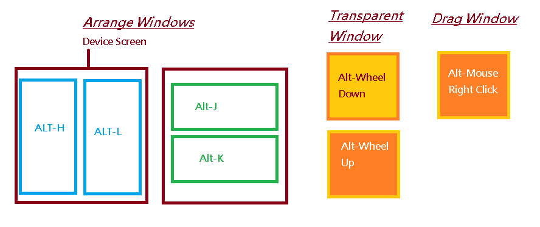
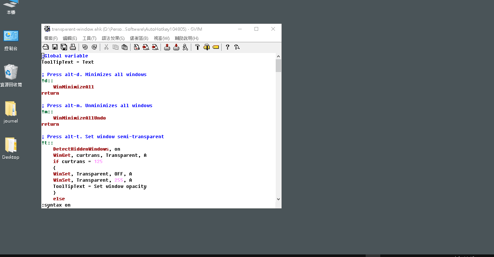

- ## transparent-window
	- A utility that makes the window transparent, arrange and more. It works on Windows 10.
- ### :crossed_swords:Functions
	- | Function | Description |
	  |---|---|
	  | `alt-d` | Minimizes all windows. |
	  | `alt-m` | Unminimizes all windows. |
	  | `alt-t` | Set window semi-transparent. |
	  | `alt-a` | Makes a window stay on top of all other windows. |
	  | `alt-x` | Maximize active wiindow |
	  | `alt-n` | Minimize active wiindow |
	  | `alt-q` | Close active window |
	  | `alt-j` | Window shrinks to half screen size and snap top |
	  | `alt-k` | Window shrinks to half screen size and snap down |
	  | `alt-h` | Window shrinks to half screen size and snap left |
	  | `alt-l` | Window shrinks to half screen size and snap right |
	  | `alt-mouse wheel down` | Make active window gradually transparent |
	  | `alt-mouse wheel up` | Make active window gradually opacity |
	  | `alt-mouse right click-drag` | Drag active window |
	  | `printscreen` | Capture screenshot then paste to mspaint |
	- 
- ### :film_projector:Demo
  
- ### :comet: Download
	- Download [transparent-window](https://drive.google.com/file/d/1J5QwmDXwjVrVZRobHoPQe_ZNrlyiFMYM/view?usp=sharing).
- ### :sparkling_heart: Buy me a coffee 
    
  If the utility solves your problem, you can buy me a coffee via [this link](https://www.buymeacoffee.com/zhihau).
- ### License
    
  MIT
